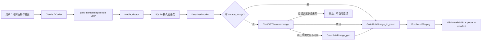
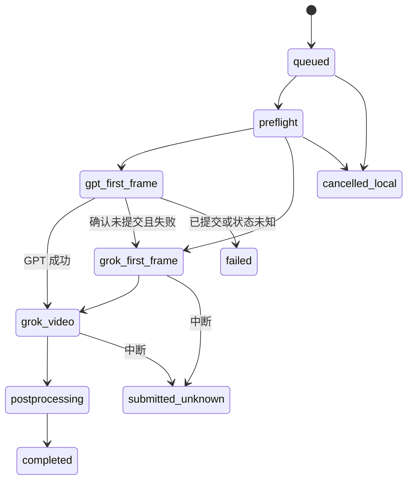

# Grok 会员媒体 MCP：实施与运行计划

## 1. 已交付目标

这个项目把两个“会员客户端能力”组合成一个本机 MCP：

- ChatGPT 已登录浏览器负责首帧生图；
- Grok Build 已登录的 grok.com 付费会员负责兜底生图和视频生成；
- Claude Code、Claude Desktop、Codex CLI、Codex Desktop 调用同一组 MCP 工具；
- 输出网站可以直接使用的 MP4、静音 fast-start MP4、poster、首帧和 manifest。

硬边界：不接入 OpenAI/xAI developer API，不读取 API key，不实现 REST
adapter，也不在会员失败后偷偷切换到 API。

## 2. “不使用 API”的精确定义

| 层 | 允许 | 禁止 |
| --- | --- | --- |
| MCP | 启动本机会员客户端进程 | 直接请求 OpenAI/xAI HTTP API |
| ChatGPT | 已登录 Chrome + `chatgpt-imagegen --backend web` | `codex` backend、`auto` backend、`OPENAI_API_KEY` |
| Grok | Grok Build CLI 的 grok.com 会员登录态 | `XAI_API_KEY`、xAI developer API、public API fallback |
| 输出 | 本机绝对路径、FFmpeg 后处理 | 把 MP4/base64 塞入模型上下文 |

Grok Build 和 Chrome 本身必须连接各自的会员服务。这里的“无 API”是指插件
不使用开发者 API、API key 或自写 REST 请求，而不是让官方客户端断网运行。

## 3. 总体架构



所有媒体生成任务都由 detached worker 执行。MCP 调用立即返回 `job_id`，避免
Claude/Codex 的单次工具调用因 6–20 分钟媒体任务而超时。

## 4. 路由规则

### 默认 `first_frame_provider=auto`

1. 检查 ChatGPT web backend。
2. 只使用 `chatgpt-imagegen --backend web` 生成首帧。
3. 如果浏览器在“明确没有提交 prompt”之前失败，才调用 Grok 会员 `image_gen`。
4. 把首帧绝对路径交给 Grok 会员 `image_to_video`。
5. 如果 ChatGPT 已经生成中、可能已提交或状态无法确定，任务停止；不重复扣额度。

### 强制 ChatGPT `first_frame_provider=chatgpt`

ChatGPT 浏览器不可用时直接失败，不切换 Grok 生图。这适合必须使用 GPT 画面
风格的任务。

### 强制 Grok `first_frame_provider=grok`

跳过 ChatGPT，使用 Grok 会员 `image_gen` 后再图生视频。

### 已有图片 `source_image=/absolute/path`

跳过所有生图，直接使用 Grok 会员 `image_to_video`。这是最稳定、最节省生图
额度的路径。

## 5. MCP 工具合同

### `media_doctor`

只做无生成检查，返回：

- `developer_api_used=false`；
- `public_xai_api_enabled=false`；
- `api_key_auth_disabled=true`；
- Grok 登录模式、版本和 ready 状态；
- ChatGPT web-only backend、浏览器 driver、relay/profile 状态；
- FFmpeg、状态目录和允许路径根。

### `start_website_video`

核心参数：

| 参数 | 值 |
| --- | --- |
| `prompt` | 首帧的视觉描述 |
| `motion_prompt` | 镜头运动与主体运动描述 |
| `output_dir` | 网站媒体目录的绝对路径 |
| `name` | 输出文件名 stem |
| `source_image` | 可选，现有首帧绝对路径 |
| `first_frame_provider` | `auto` / `chatgpt` / `grok` |
| `duration_seconds` | `6` 或 `10` |
| `resolution` | `480p` 或 `720p` |
| `aspect_ratio` | `16:9`、`9:16`、`1:1`、`4:3`、`3:4` |

返回 `job_id`，不会等待视频完成。

### `get_media_job`

轮询任务状态。只有 `completed` 才可以把产物写入网站。

### `list_media_jobs`

查看最近任务，避免 agent 因丢失上下文重复提交同一会员任务。

### `cancel_media_job`

停止本机 worker，但不会声称已取消上游 Grok 请求。Grok 已接收请求时状态会被
保守地标记为未知，禁止自动重试。

## 6. 任务状态与重复扣额度控制



控制措施：

- 相同规范化请求生成相同 idempotency key；
- 默认复用已有任务，不启动第二个 worker；
- `output_dir + name` 在 SQLite 中有唯一 reservation，不同 prompt 不能先消耗
  额度再争抢同一输出文件；
- 公共 MCP 不提供绕过幂等的开关；只有上一任务明确为
  `not_submitted + retry_safe` 时，相同请求才能建立新的安全重试任务；
- Grok 媒体工具按机器级 `flock` 串行；
- Grok `tool_call_id` 与完成事件严格匹配，不能靠“最新的 1.mp4”猜结果；
- 每个 provider 调用必须只有一个 tool call，且实际 `raw_input` 必须逐项匹配
  请求参数；
- `submitted_unknown` 和所有已确认提交的失败都不自动重试。

后处理在输出目录的隐藏 staging 中进行。完整解码、时长、分辨率、宽高比、
H.264/yuv420p web MP4、静音和 SHA-256 全部通过后才发布最终文件。用户源图会先
复制为任务内不可变快照，避免校验与生成之间被替换。最终发布使用同文件系统的
hard-link no-replace 语义，不会覆盖竞态出现的同名文件；manifest 最后发布，普通
异常和可捕获信号会回滚。断电或 SIGKILL 无法让多个独立文件具备事务级原子性，
但不会形成有效 completed bundle，也不会自动重试消耗额度。

## 7. 会员客户端协议

### ChatGPT

固定调用 vendored `chatgpt-imagegen v0.21.0`：

```text
--backend web
--profile auto
--project hybrid-media-mcp
--no-style
--format png
--quiet
-- <prompt>
```

MCP 不暴露 backend 参数，因此 prompt 里写 `--backend codex` 也不能注入参数。
vendored 上游文件为了校验来源保持不变，内部仍包含上游 Codex 实现；实际运行先经过
`scripts/chatgpt-imagegen-web-only`，任何不是精确 `--backend web` 的生成命令都会在
启动浏览器前以 exit 64 被拒绝。

### Grok

每个媒体请求创建唯一 session UUID，限制 agent 只能看见一个媒体工具：

```text
--model grok-4.5
--tools image_gen 或 image_to_video
--permission-mode bypassPermissions
--no-subagents --no-memory --no-plan --disable-web-search
--max-turns 3 --output-format streaming-json
```

进程环境强制：

```text
GROK_DISABLE_API_KEY_AUTH=1
```

同时删除 OpenAI、xAI、Grok 和 Anthropic 常见 API key/base URL 环境变量。

## 8. 媒体产物

一次完成任务输出：

```text
<name>.mp4                 原始 master，保留 Grok AAC 音轨
<name>-web.mp4             静音、fast-start，适合网站 autoplay
<name>-poster.jpg          首帧 poster
<name>-first-frame.png     按目标比例规范化后实际用于图生视频的首帧
<name>-manifest.json       请求、provider、session、ffprobe、SHA-256
```

网站推荐：

```html
<video autoplay muted loop playsinline poster="/media/hero-poster.jpg">
  <source src="/media/hero-web.mp4" type="video/mp4" />
</video>
```

不要把带声音的 master 用于自动播放；浏览器通常会阻止有声 autoplay。

## 9. 客户端安装

统一启动器：

```text
$HOME/.local/bin/grok-membership-media-mcp
```

`./scripts/setup.sh` 会把完整运行时重新安装到
`$HOME/.local/share/grok-membership-media-mcp/runtime`，并创建这个只含 ASCII
字符的真实 wrapper 文件（不是指回仓库的软链接）。仓库本身可以放在
`Documents`、含空格或非 ASCII 字符的目录中；客户端不要直接引用仓库路径。
macOS 可能拒绝桌面 MCP 子进程读取 `Documents` 中的脚本，而软链接仍会按真实
目标接受系统策略检查。

Codex CLI 与 Codex Desktop 共用 `~/.codex/config.toml`：

```bash
codex mcp add grok-membership-media -- \
  "$HOME/.local/bin/grok-membership-media-mcp"
```

Claude Code：

```bash
claude mcp add --scope user grok-membership-media -- \
  "$HOME/.local/bin/grok-membership-media-mcp"
```

Claude Desktop 的 `claude_desktop_config.json`：

```json
{
  "mcpServers": {
    "grok-membership-media": {
      "command": "/absolute/path/to/home/.local/bin/grok-membership-media-mcp",
      "args": []
    }
  }
}
```

项目 skill 同时安装到 `~/.codex/skills/grok-membership-media` 和
`~/.claude/skills/grok-membership-media`，用于把“给网站制作视频”这类自然语言
请求稳定路由到 MCP。

## 10. ChatGPT 浏览器 relay

`chrome-use` CLI 和 native host 可以自动安装，但 Chrome Web Store 扩展必须由
用户在已登录 ChatGPT 的 `Default` profile 中确认一次：

```text
https://chromewebstore.google.com/detail/chrome-use/knfcmbamhjmaonkfnjhldjedeobeafmk
```

扩展安装后，不重启 Chrome 的连接命令：

```bash
~/.local/bin/chrome-use reconnect --keep-banner
~/.local/bin/chrome-use extension status --json
~/.local/bin/chrome-use browsers --json
```

在 relay 未连接时，`auto` 任务会先尝试 GPT；只有确认 prompt 未提交才安全地
切换 Grok 生图。视频主链路不依赖该扩展。

## 11. 测试和验收标准

自动测试必须覆盖：

- 环境中所有已知 API key/base URL 被清除；
- 源码没有 xAI REST endpoint 或 HTTP client；
- ChatGPT backend 被硬编码为 `web`，prompt 不能注入 CLI flags；
- 提交前失败可以 fallback，提交后/未知失败绝不 retry；
- Grok 结果按 session UUID + tool call ID 匹配；
- SQLite job 持久化和幂等；
- 输出路径不能逃逸允许根目录；
- 媒体 magic bytes、ffprobe、SHA-256 验证。
- 每个媒体文件和 manifest 自身都必须有 SHA-256，读取 completed 任务时重新计算；
- manifest 的 request、outputs 和无 developer API policy 必须与 SQLite 深度一致；
- worker 启动宽限、child 自写 PID、source snapshot、no-replace 发布竞态。

真实验收：

- Grok doctor 必须显示 `grok.com_membership` 和 API-key auth disabled；
- MCP `tools/list` 能发现 5 个工具；
- Claude 和 Codex 都能真实调用 `media_doctor`；
- 至少一次真实 6 秒 720p Grok 会员视频完成；
- master 包含 H.264 + AAC，web MP4 为静音 H.264；
- manifest 中 `developer_api_used=false`。

当前实测任务已完成并再次通过加固版验证：6.041667 秒、1280x720；master 为
H.264 + AAC，web MP4 为 H.264 静音。公开仓库只保留清理 metadata 后的 web MP4、
poster 和脱敏证据；原始任务 manifest、会话标识与本机路径不进入 Git。

## 12. 后续版本

V0.1 已覆盖网站首帧 + 图生视频主链路。后续只有在确有需求时再增加：

- Grok `reference_to_video` 的 2–7 张参考图工具；
- 分镜列表与多个 6/10 秒片段拼接；
- 网站项目自动读取品牌色、产品图和目标组件尺寸；
- 独立 ACP 长连接，实时获取 Grok tool events；
- 可选本地管理 UI。核心“无 developer API”约束不改变。
